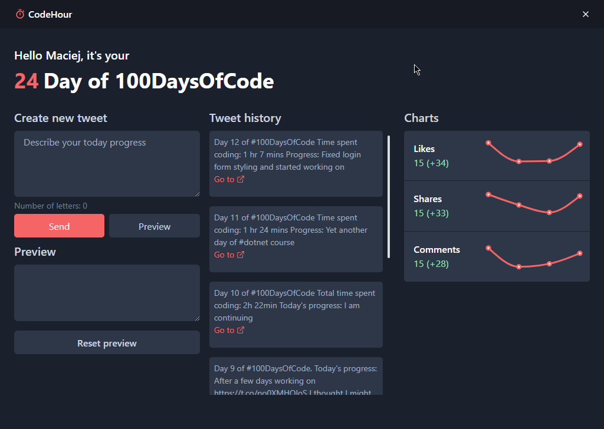

<h1 align="center">Welcome to Code Hour 👋</h1>
<p>
  
  </img>
  <a href="https://github.com/electron-react-boilerplate/electron-react-boilerplate/graphs/commit-activity" target="_blank">
    
  </a>
  <a href="https://twitter.com/maciej_wiatr" target="_blank">
    
  </a>
</p>

> Code Hour is a app that helps you share your daily 100days of code challange progress!

### 🏠 [Homepage](https://github.com/MaciejWiatr/code-hour)

## Before you try to run it
You have to create .env file with following data:
```sh
API_KEY=<your_twitter_api_key>
API_KEY=<your_twitter_secret_api_key>
A_TOKEN=<your_twitter_access_token>
A_TOKEN_SECRET=<your_twitter_secret_token>
```
This is only temporary solution, later on i'll provide first party installer and development version will feature ui elements to set this data manually through app

## Install

```sh
yarn install
```

## Usage

```sh
yarn run start
```

## Create executable

```sh
yarn package
```

## Author

👤 **Maciej Wiatr**

-   Website: mwiatr.live
-   Twitter: [@maciej_wiatr](https://twitter.com/maciej_wiatr)
-   Github: [@MaciejWiatr](https://github.com/MaciejWiatr)
-   LinkedIn: [@maciej-wiatr](https://linkedin.com/in/maciej-wiatr)

## Show your support

Give a ⭐️ if this project helped you!

---

_This README was generated with ❤️ by [readme-md-generator](https://github.com/kefranabg/readme-md-generator)_
